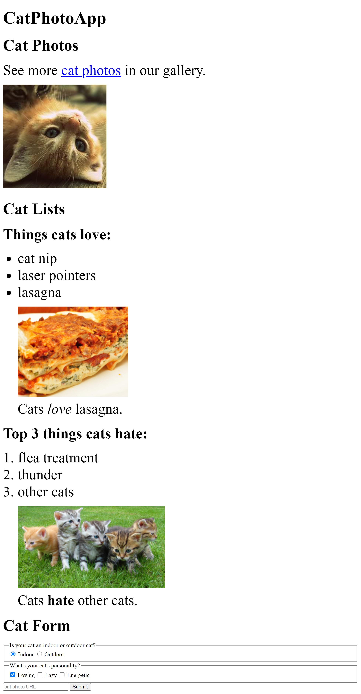

# Cat Photo App

### Made with freecodecamp certification program

## Learning:

In this tutorial, I am learning about Html.**HTML is stand for HYPER TEXT MARKUP LANGUAGE**, which means we define every thing with a specific markup. we will learn about different type of tags and element like:

- Heading
- Paragraph
- Order List
- Umorder List
- Image
- Anchor tag
- Form Element
- Input
- Label
- Legend
- Fieldset

## DEMO

<a href="#">click here to check demo website</a>

